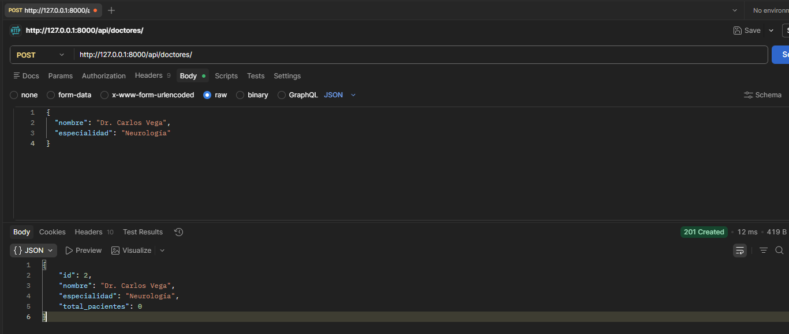
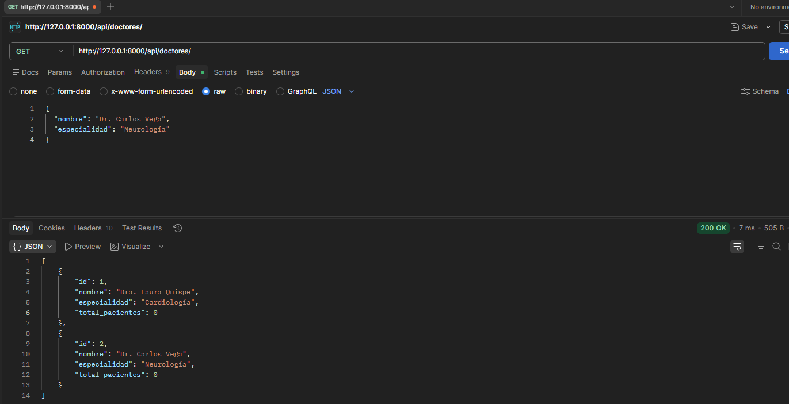
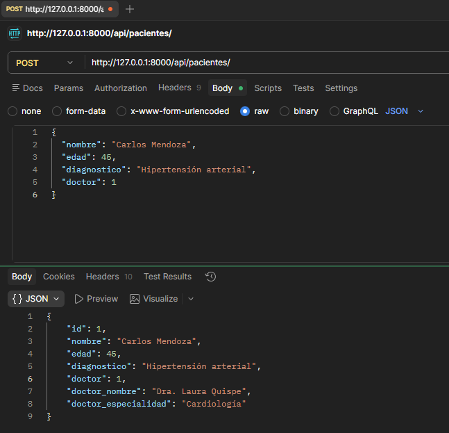
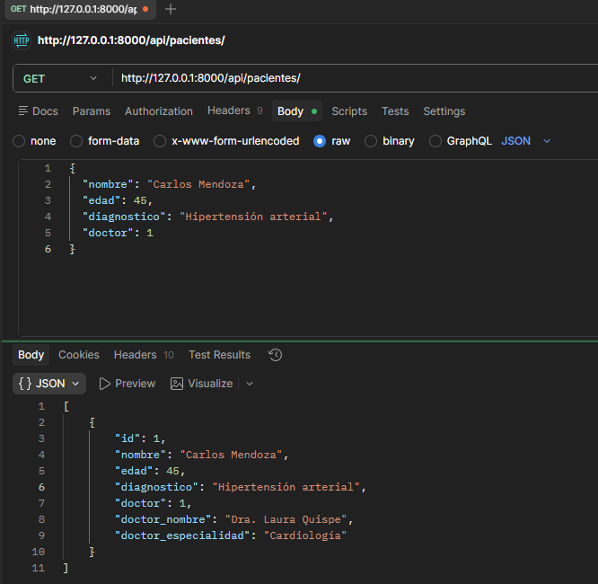
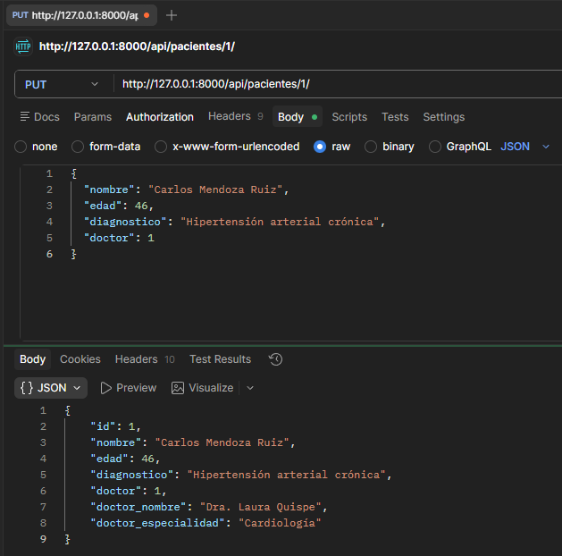
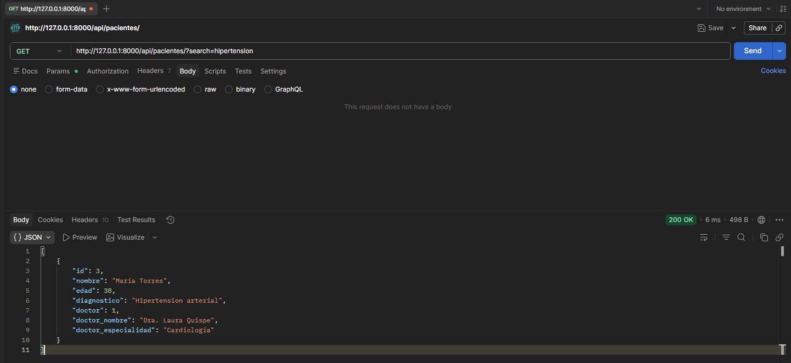
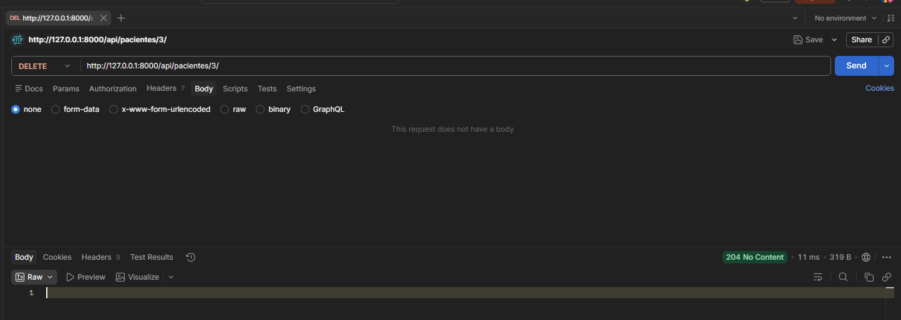
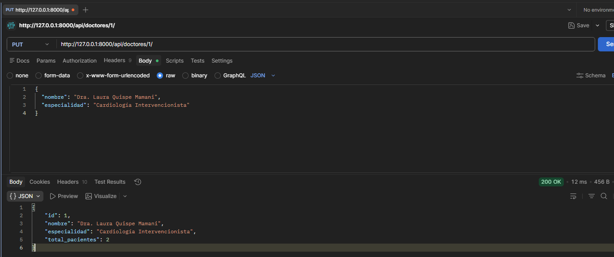
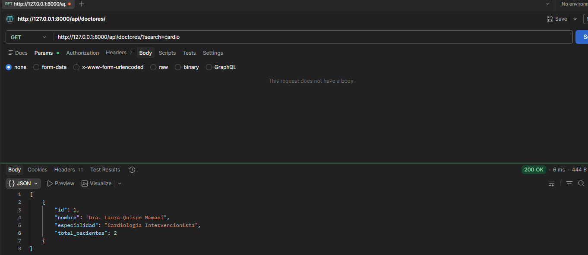
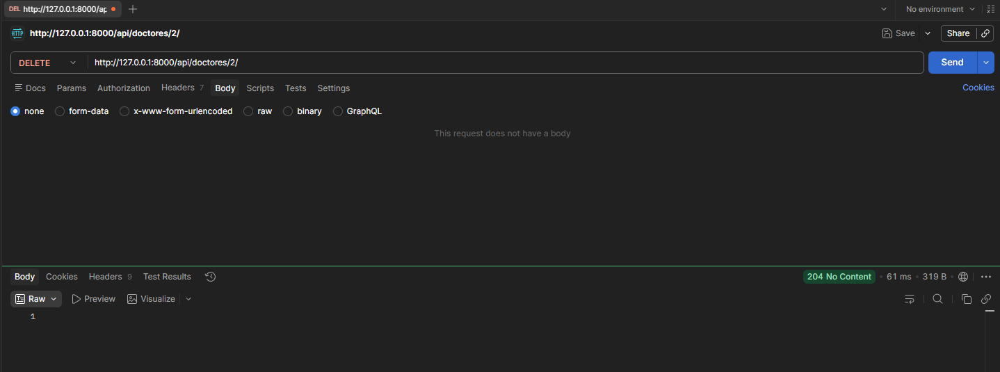

# 🏥 HealthTrack API

API REST para la gestión de pacientes y doctores en un entorno médico.

## 🛠️ Tecnologías
- Python 3.x
- Django
- Django REST Framework

## ▶️ Instrucciones para ejecutar

```bash
git clone https://github.com/JasonGomezzz/healthtrack_api.git
cd healthtrack_api
python -m venv venv
venv\Scripts\activate
pip install -r requirements.txt
python manage.py migrate
python manage.py runserver
```

## 📡 Endpoints disponibles

### 🧑‍⚕️ Doctores

| Método | Endpoint | Descripción |
|--------|----------|-------------|
| GET | `/api/doctores/` | Lista todos los doctores con total de pacientes |
| POST | `/api/doctores/` | Crea un nuevo doctor |
| PUT | `/api/doctores/{id}/` | Actualiza un doctor existente |
| DELETE | `/api/doctores/{id}/` | Elimina un doctor |
| GET | `/api/doctores/?search=cardio` | Busca por nombre o especialidad |

### 🧑‍🦽 Pacientes

| Método | Endpoint | Descripción |
|--------|----------|-------------|
| GET | `/api/pacientes/` | Lista todos los pacientes con doctor anidado |
| POST | `/api/pacientes/` | Crea un nuevo paciente |
| PUT | `/api/pacientes/{id}/` | Actualiza un paciente existente |
| DELETE | `/api/pacientes/{id}/` | Elimina un paciente |
| GET | `/api/pacientes/?search=hipertension` | Busca por nombre o diagnóstico |

---

## 📸 Evidencia de endpoints

### ➕ 1. Crear Doctor — POST /api/doctores/
```json
{
  "nombre": "Dra. Laura Quispe",
  "especialidad": "Cardiología"
}
```


---

### 📃 2. Listar Doctores — GET /api/doctores/


---

### ➕ 3. Crear Paciente — POST /api/pacientes/
Muestra `doctor_nombre` y `doctor_especialidad` **(punto extra ✨)**
```json
{
  "nombre": "María Torres",
  "edad": 38,
  "diagnostico": "Hipertension arterial",
  "doctor": 1
}
```


---

### 📃 4. Listar Pacientes — GET /api/pacientes/


---

### ✏️ 5. Editar Paciente — PUT /api/pacientes/1/
```json
{
  "nombre": "Carlos Mendoza Ruiz",
  "edad": 46,
  "diagnostico": "Hipertensión arterial crónica",
  "doctor": 1
}
```


---

### 🔍 6. Buscar Paciente — GET /api/pacientes/?search=hipertension


---

### ❌ 7. Eliminar Paciente — DELETE /api/pacientes/3/


---

### ✏️ 8. Editar Doctor — PUT /api/doctores/1/
```json
{
  "nombre": "Dra. Laura Quispe Mamani",
  "especialidad": "Cardiología Intervencionista"
}
```


---

### 🔍 9. Buscar Doctor — GET /api/doctores/?search=cardio


---

### ❌ 10. Eliminar Doctor — DELETE /api/doctores/2/
